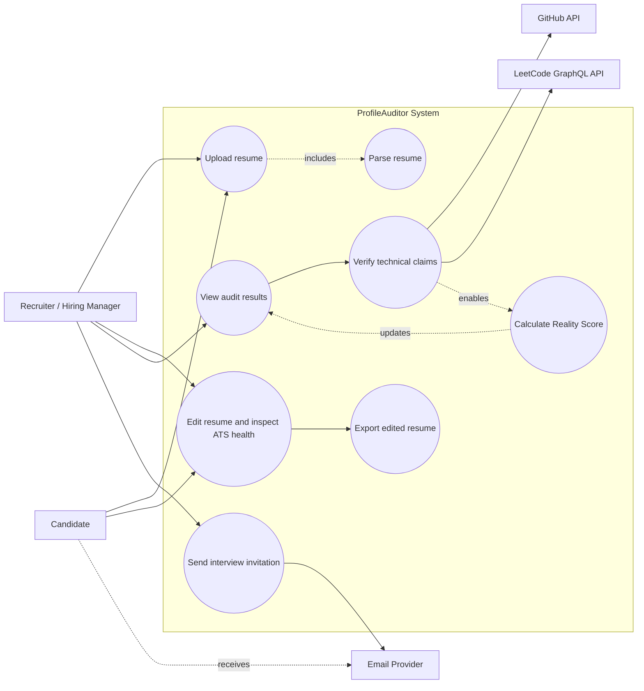

# ProfileAuditor Use Case Diagram

```mermaid
flowchart LR
    recruiter[Recruiter / Hiring Manager]
    candidate[Candidate]
    github[GitHub API]
    leetcode[LeetCode GraphQL API]
    email[Email Provider]

    subgraph ProfileAuditor[ProfileAuditor System]
        upload((Upload resume))
        parse((Parse resume))
        edit((Edit resume and inspect ATS health))
        verify((Verify technical claims))
        score((Calculate Reality Score))
        view((View audit results))
        invite((Send interview invitation))
        export((Export edited resume))
    end

    recruiter --> upload
    recruiter --> edit
    recruiter --> view
    recruiter --> invite
    candidate --> upload
    candidate --> edit
    upload -. includes .-> parse
    view --> verify
    verify --> github
    verify --> leetcode
    verify -. enables .-> score
    score -. updates .-> view
    edit --> export
    invite --> email
    candidate -. receives .-> email
```
