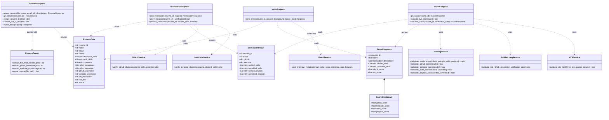

# ProfileAuditor Class Diagram

```mermaid
classDiagram
    class ResumeEndpoint {
        +upload_resume(file, name, email, job_description) ResumeResponse
        +get_resume(resume_id) ResumeData
        +extract_resume_text(file) dict
        +convert_pdf_to_doc(file) dict
        +export_docx(request) Response
    }

    class ResumeParser {
        +extract_text_from_file(file_path) str
        +extract_github_username(text) str
        +extract_leetcode_username(text) str
        +parse_resume(file_path) dict
    }

    class ResumeData {
        +str resume_id
        +str name
        +str email
        +str phone
        +List~str~ technical_skills
        +List~str~ soft_skills
        +List~dict~ projects
        +List~dict~ experience
        +List~dict~ education
        +str github_username
        +str leetcode_username
        +str job_description
        +str raw_text
        +str status
    }

    class VerificationEndpoint {
        +start_verification(resume_id, request) VerificationResponse
        +get_verification(resume_id) VerificationResult
        +process_verification(resume_id, resume_data, handles)
    }

    class VerificationResult {
        +str resume_id
        +str status
        +dict github
        +dict leetcode
        +List~str~ verified_skills
        +List~str~ unverified_skills
        +List~str~ verified_projects
        +List~str~ unverified_projects
    }

    class GitHubService {
        +verify_github_claims(username, skills, projects) dict
    }

    class LeetCodeService {
        +verify_leetcode_claims(username, claimed_skills) dict
    }

    class ScoreEndpoint {
        +get_score(resume_id) ScoreResponse
        +evaluate_live_ats(request) dict
        +calculate_score(resume_id, verification_data) ScoreResponse
    }

    class ScoreResponse {
        +str resume_id
        +float score
        +ScoreBreakdown breakdown
        +List~str~ verified_skills
        +List~str~ unverified_skills
        +float job_fit_score
        +float ats_score
    }

    class ScoreBreakdown {
        +float github_score
        +float leetcode_score
        +float skills_score
        +float projects_score
    }

    class ScoringService {
        +calculate_reality_score(github, leetcode, skills, projects) tuple
        +calculate_github_score(results) float
        +calculate_leetcode_score(results) float
        +calculate_skills_score(verified, unverified) float
        +calculate_projects_score(verified, unverified) float
    }

    class JobMatchingService {
        +evaluate_role_fit(job_description, verification_data) dict
    }

    class ATSService {
        +evaluate_ats_health(raw_text, parsed_resume) dict
    }

    class InviteEndpoint {
        +send_invite(resume_id, request, background_tasks) InviteResponse
    }

    class EmailService {
        +send_interview_invitation(email, name, score, message, date, location)
    }

    ResumeEndpoint ..> ResumeParser : parses with
    ResumeEndpoint ..> ResumeData : returns
    VerificationEndpoint ..> ResumeData : reads
    VerificationEndpoint ..> VerificationResult : creates
    VerificationEndpoint ..> GitHubService : calls
    VerificationEndpoint ..> LeetCodeService : calls
    ScoreEndpoint ..> VerificationResult : reads
    ScoreEndpoint ..> ScoreResponse : returns
    ScoreEndpoint ..> ScoringService : uses
    ScoreEndpoint ..> JobMatchingService : uses
    ScoreEndpoint ..> ATSService : uses
    ScoreResponse *-- ScoreBreakdown
    InviteEndpoint ..> ResumeData : reads
    InviteEndpoint ..> ScoreResponse : reads
    InviteEndpoint ..> EmailService : schedules
```
