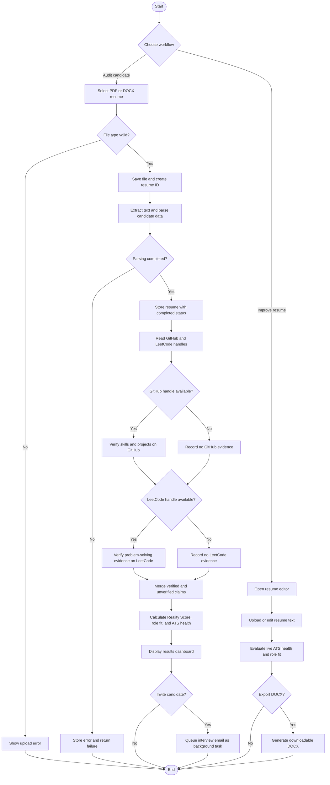

# ProfileAuditor Activity Diagram

```mermaid
flowchart TD
    start([Start]) --> choose{Choose workflow}

    choose -->|Audit candidate| select[Select PDF or DOCX resume]
    select --> valid{File type valid?}
    valid -->|No| uploadError[Show upload error]
    uploadError --> stop([End])
    valid -->|Yes| save[Save file and create resume ID]
    save --> parse[Extract text and parse candidate data]
    parse --> parsed{Parsing completed?}
    parsed -->|No| processingError[Store error and return failure]
    processingError --> stop
    parsed -->|Yes| completed[Store resume with completed status]
    completed --> handles[Read GitHub and LeetCode handles]
    handles --> gh{GitHub handle available?}
    gh -->|Yes| github[Verify skills and projects on GitHub]
    gh -->|No| noGithub[Record no GitHub evidence]
    github --> lc{LeetCode handle available?}
    noGithub --> lc
    lc -->|Yes| leetcode[Verify problem-solving evidence on LeetCode]
    lc -->|No| noLeetcode[Record no LeetCode evidence]
    leetcode --> merge[Merge verified and unverified claims]
    noLeetcode --> merge
    merge --> score[Calculate Reality Score, role fit, and ATS health]
    score --> results[Display results dashboard]
    results --> invite{Invite candidate?}
    invite -->|Yes| email[Queue interview email as background task]
    invite -->|No| stop
    email --> stop

    choose -->|Improve resume| editor[Open resume editor]
    editor --> editorInput[Upload or edit resume text]
    editorInput --> ats[Evaluate live ATS health and role fit]
    ats --> export{Export DOCX?}
    export -->|Yes| docx[Generate downloadable DOCX]
    export -->|No| stop
    docx --> stop
```
