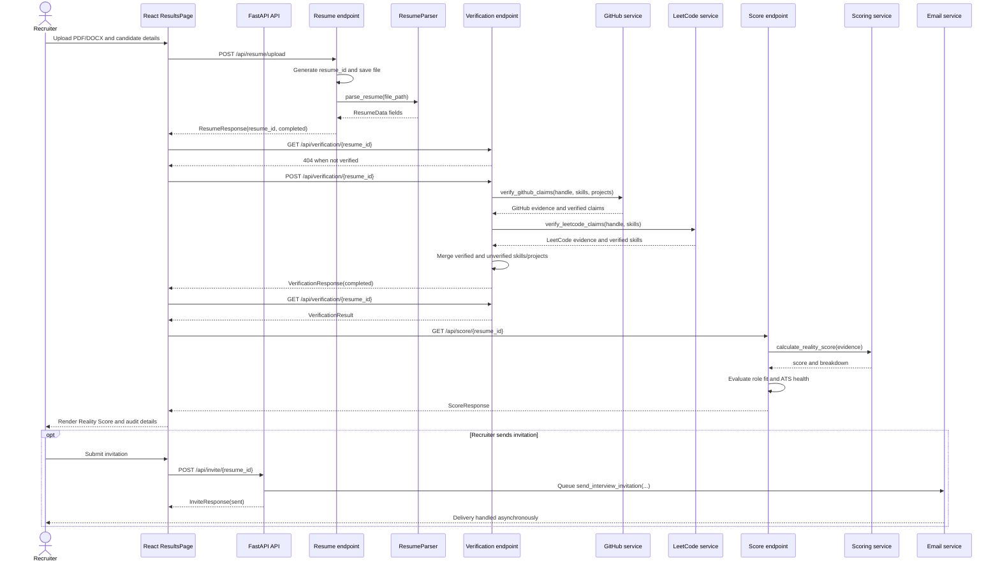

# ProfileAuditor Sequence Diagram

```mermaid
sequenceDiagram
    actor Recruiter
    participant UI as React ResultsPage
    participant API as FastAPI API
    participant Resume as Resume endpoint
    participant Parser as ResumeParser
    participant Verify as Verification endpoint
    participant GitHub as GitHub service
    participant LeetCode as LeetCode service
    participant Score as Score endpoint
    participant Scoring as Scoring service
    participant Email as Email service

    Recruiter->>UI: Upload PDF/DOCX and candidate details
    UI->>Resume: POST /api/resume/upload
    Resume->>Resume: Generate resume_id and save file
    Resume->>Parser: parse_resume(file_path)
    Parser-->>Resume: ResumeData fields
    Resume-->>UI: ResumeResponse(resume_id, completed)

    UI->>Verify: GET /api/verification/{resume_id}
    Verify-->>UI: 404 when not verified
    UI->>Verify: POST /api/verification/{resume_id}
    Verify->>GitHub: verify_github_claims(handle, skills, projects)
    GitHub-->>Verify: GitHub evidence and verified claims
    Verify->>LeetCode: verify_leetcode_claims(handle, skills)
    LeetCode-->>Verify: LeetCode evidence and verified skills
    Verify->>Verify: Merge verified and unverified skills/projects
    Verify-->>UI: VerificationResponse(completed)

    UI->>Verify: GET /api/verification/{resume_id}
    Verify-->>UI: VerificationResult
    UI->>Score: GET /api/score/{resume_id}
    Score->>Scoring: calculate_reality_score(evidence)
    Scoring-->>Score: score and breakdown
    Score->>Score: Evaluate role fit and ATS health
    Score-->>UI: ScoreResponse
    UI-->>Recruiter: Render Reality Score and audit details

    opt Recruiter sends invitation
        Recruiter->>UI: Submit invitation
        UI->>API: POST /api/invite/{resume_id}
        API->>Email: Queue send_interview_invitation(...)
        API-->>UI: InviteResponse(sent)
        Email-->>Recruiter: Delivery handled asynchronously
    end
```
